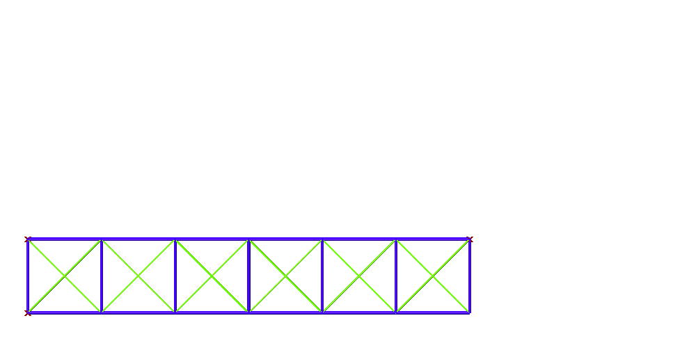

# Design Code

Computational Design

# About

Welcome to Design Code, a repository of computing as a means of design and impact in creative disciplines and pedagogies related to design education.

Here you will find experiments in design geometry, parametric modeling, digital fabrication ...

---

## 001 Simple Truss

Drawing a simple truss

Environment - rhinoceros + grasshopper

Language    - python

---
